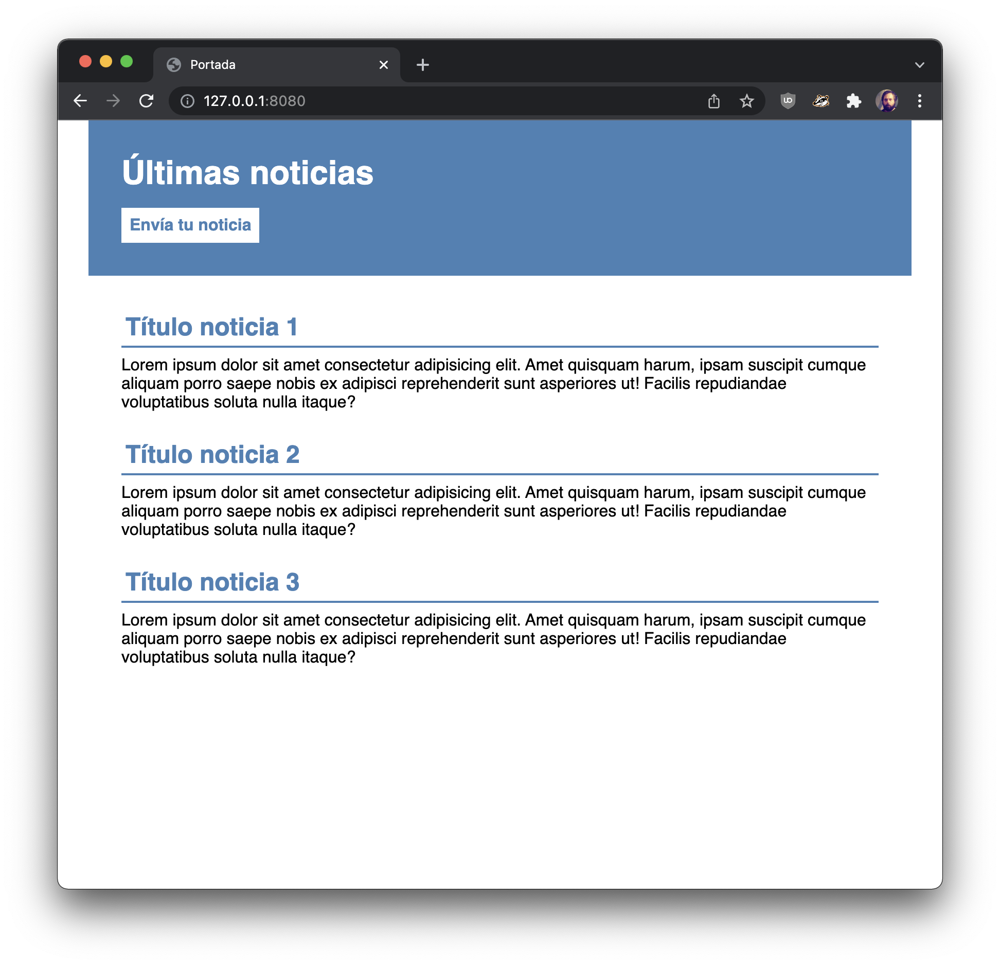
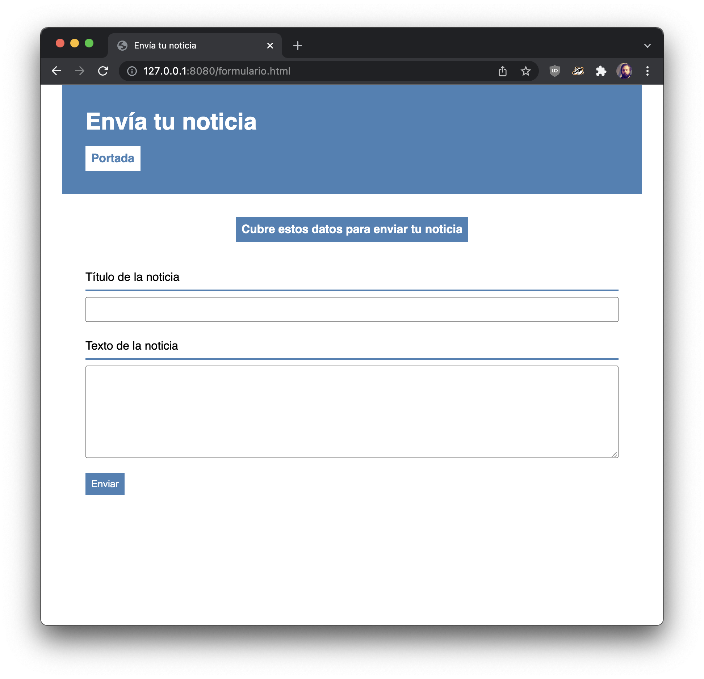

# Ejercicio por parejas

Este es un ejercicio por parejas, una de las dos personas participantes tiene que descargar manualmente el código este repositorio y publicarlo en un repo de github antes de empezar.

Este ejercicio es un poco peculiar: el CSS ya está acabado, pero falta parte del HTML. Tenéis que crear el HTML necesario en `index.html` y en `formulario.html` para que al aplicar el CSS proporcionado en `css/style.css` el sitio web tenga un aspecto exactamente igual al de las siguitentes capturas.

Para ello tendréis que analizar los selectores de CSS en el archivo `css/style.css` y deducir que estructura de HTML es necesaria.

Una última cosa: cada una de las personas debe trabajar al mismo tiempo en el código, una persona en la portada y otra en el formulario, para ello tenéis que clonar el repositorio que creásteis inicialmente en github en vuestros ordenadores y cada persona debe crear un _branch_ de trabajo. Cuando el trabajo esté completado debéis unir vuestro trabajo en el _branch_ principal (main).

Suerte!
