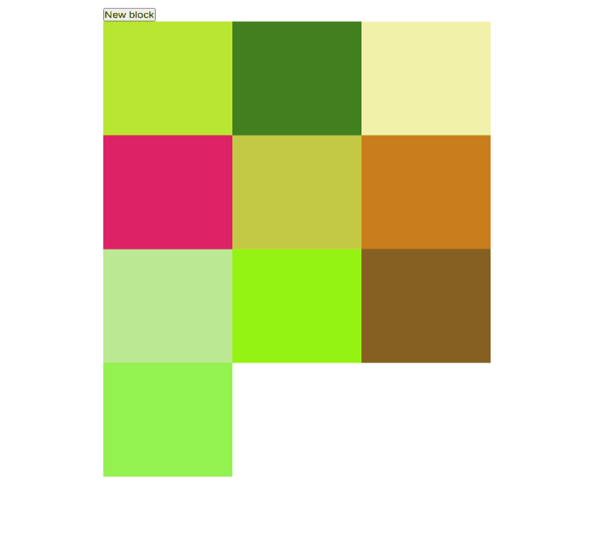

# Ejercicio 1

Crea una malla de cuadrados tal que el color de cada uno de ellos se determine de forma aleatoria y vaya cambiando periódicamente. Añade también un botón que te permita añadir un nuevo cuadrado a la maya con las mismas propiedaes que los anteriores.

